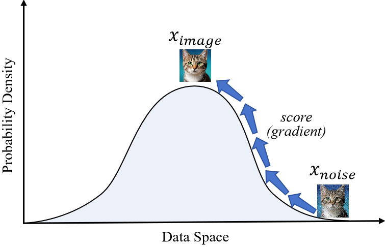
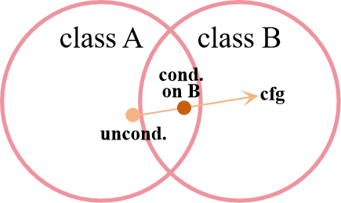
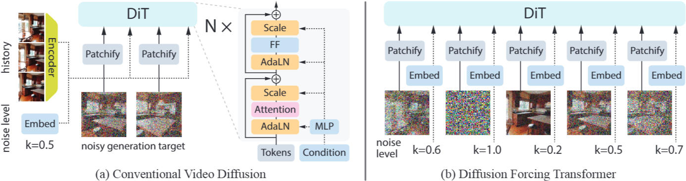

# A Gentle Introduction to Guidance in Diffusion Models

Diffusion models have become a cornerstone of modern generative AI, capable of creating stunningly realistic images, audio, and more. While generating random high-quality samples is impressive, the real magic happens when we can control what the model generates. This control is achieved through a technique called guidance.

This post will explore an overview of guidance techniques in diffusion models. We will begin with the foundational concepts of classifier guidance and classifier-free guidance. We will then dive into advanced applications like multi-condition guidance, history guidance, and inner guidance.

## A Quick Recap of Diffusion Models

Let's assume you have a basic understanding of how diffusion or flow-matching models work. In short, training a diffusion model involves two processes:

1.  **Forward Process**: We start with a clean data point $x_0$ (like an image) and incrementally add Gaussian noise over a series of timesteps $t$. By the final timestep $T$, the data $x_T$ becomes indistinguishable from pure Gaussian noise.
2.  **Reverse Process**: We train a neural network to reverse this process. During inference, the model starts with random noise and gradually "denoises" it over the same timesteps to produce a clean sample.

The reverse process can be modeled as a conditional probability distribution, where the model predicts the data at the previous timestep $x_{t-1}$ given the current noisy data $x_t$:

$$
\begin{equation}
q_\theta (x_{t-1}|x_t) \sim \mathcal{N}(x_{t-1}, \mu_\theta(x_t, t), \Sigma_\theta(x_t, t))
\end{equation}
$$

While there are many ways to parameterize a diffusion model (e.g., predicting the noise, predicting the clean image $x_0$), they are largely equivalent. For our purposes, it's most intuitive to use the **score-based formulation**:

$$
\begin{equation}
\mu_\theta(x_t, t) = \frac{1}{\sqrt\alpha_t} x_t + \frac{1-\alpha_t}{\sqrt\alpha_t}\nabla_{x_t} \log p(x_t)
\end{equation}
$$

Here, the gradient of the log probability of the data distribution $\nabla_{x_t} \log p(x_t)$ is called the "score". We thus train a neural network to estimate the score function:

$$
\begin{equation}
\nabla \log p(x_t) \approx s_\theta (x_t, t)
\end{equation}
$$

Intuitively, this score function, $s_\theta(x_t, t)$, tells us tells us the direction to move in the data space to make any noisy sample $x_t$ more probable under the learned data distribution. It always points from a low-density region (more noise) toward a high-density region (less noise), effectively showing the model how to "climb" the probability hill.

The denoising update rule can then be expressed using this learned score:
$$
\begin{equation}
\mu_\theta(x_t, t) = \frac{1}{\sqrt{\alpha_t}} \left( x_t - \frac{1-\alpha_t}{\sqrt{1-\bar{\alpha}_t}}s_\theta(x_t, t) \right)
\end{equation}
$$
where $\alpha_t$ and $\bar{\alpha}_t$ are noise schedule constants. So far, this model is **unconditional**—it generates random samples but doesn't give us any control over *what* it generates.

### Further Disscusion on Diffusion

Here, I want to share two insightful perspectives on diffusion models that reframe our understanding of how they work, drawing from concepts in recent literature that I find particularly compelling.

**1) Noise as Frequency-Domain Masking.** The process of adding noise can be intuitively understood as a form of **masking in the frequency domain**. This perspective draws a compelling parallel to Masked Autoencoders (MAE), a successful self-supervised learning (SSL) technique where masking parts of the input forces the model to learn robust semantic representations. This might explain why diffusion models develop strong internal representations. While SSL methods are still arguably superior in pure representation learning, the potential for diffusion models to bridge the gap is immense. Works like REPA have shown that better representations improve generation. The inverse—that the act of generation improves representation—remains a promising frontier yet to be fully realized.

**2) Denoising as Autoregression on the Noise Axis.** While diffusion and autoregressive models are often treated as distinct families, the denoising process is fundamentally a form of **autoregression along the noise-level axis**. Think of a standard autoregressive model, which predicts the next element in a sequence given the previous one: $p(\text{token}_i | \text{token}_{i-1})$. The diffusion model's reverse process does exactly this, but across noise timesteps: $p(x_{t-1}|x_t)$. Each denoising step is therefore an autoregressive prediction, forming a sequential chain that transforms pure noise into a clean data sample. This reframes diffusion not as a monolithic generator but as an iterative refinement process, where the model autoregressively "predicts" the preceding, cleaner state at each step.

---

## Introducing Conditions for Controllable Generation

To control the generation process, we need to make it conditional. We want to sample not from the general data distribution $p(x_t)$, but from a **conditional distribution** $p(x_t|y)$, where $y$ is our desired condition (e.g., a class label like "dog" or a text description).

Intuitively, we can just modify our score function to be conditional:
$$
\begin{equation}
s_\theta(x_t, t) \rightarrow s_\theta(x_t, y, t)
\end{equation}
$$
This means feeding the condition $y$ into our neural network alongside the noisy input $x_t$. While simple, this approach often fails to produce samples that strictly adhere to the condition.

Why? Generating a sample that perfectly matches a condition is often much harder than simply classifying it. For instance, a model that can generate a perfect image of a "Siberian Husky" must implicitly be a perfect classifier for Siberian Huskies. It's more likely that a dedicated classifier model will be better at recognizing the condition than a generative model will be at producing it.

This observation is the key insight behind **classifier guidance**.

---

## Classifier Guidance

Instead of relying solely on the generative model, we can leverage the power of a separate, pre-trained classifier to "guide" the diffusion process.

We start with the conditional score $\nabla_{x_t} \log p(x_t|y)$. Using Bayes' theorem, we can decompose it:
$$
\begin{equation}
\log p(x_t|y) = \log \frac{p(y|x_t) p(x_t)}{p(y)} = \log p(y|x_t) + \log p(x_t) - \log p(y)
\end{equation}
$$
Now, we take the gradient with respect to $x_t$:
$$
\begin{equation}
\nabla_{x_t} \log p(x_t|y) = \underbrace{\nabla_{x_t} \log p(x_t)}_{\text{Unconditional Score}} + \underbrace{\nabla_{x_t} \log p(y|x_t)}_{\text{Guidance from Classifier}}
\end{equation}
$$
(Note that $\nabla_{x_t} \log p(y)$ is zero because $p(y)$ doesn't depend on $x_t$.)

This elegant equation shows that the conditional score is just the **unconditional score plus a guidance term**. This guidance term, $\nabla_{x_t} \log p(y|x_t)$, is exactly what a classifier provides: it's the gradient that pushes $x_t$ to be more recognizable as class $y$.

To control the strength of this guidance, we introduce a guidance scale hyperparameter $\lambda > 1$:
$$
\begin{equation}
\hat{s}_\theta(x_t, y, t) = s_\theta(x_t, t) + \lambda \cdot \nabla_{x_t} \log p_\phi(y|x_t)
\end{equation}
$$
Here, $p_\phi$ represents our separate pre-trained classifier. During each denoising step, we use this modified score $\hat{s}_\theta$ to steer the generation toward the desired class.

Let's take a look at the weighted formulation in the probability space:
$$
\begin{equation}
\widetilde{p}_\theta (x_t | y) \propto p_\theta (x_t | y) \cdot p_\theta (y | x_t)^\lambda
\end{equation}
$$
So its physical meaning is actually to make the data with higher probablity of class $y$ to have higher likelihood so that we can easier to sample.

Let's look at how the guidance term is calculated in practice, using [OpenAI's guided-diffusion code](https://github.com/openai/guided-diffusion/blob/22e0df8183507e13a7813f8d38d51b072ca1e67c/scripts/classifier_sample.py#L54-L61) as a reference:

$$
\begin{array}{l|l}
\texttt{with th.enable\_grad():} & \\
\texttt{    x\_in = x.detach().requires\_grad\_(True)} & \\
\texttt{    logits = classifier(x\_in, t)} & \text{Get classifier's raw output scores for } x_t. \\
\texttt{    log\_probs = F.log\_softmax(logits, dim=-1)} & \text{Convert scores to log probabilities, } \log p_\phi(y|x_t). \\
\texttt{    selected = log\_probs[range(len(logits)), y.view(-1)]} & \text{Select the log probability for the target class } y. \\
\texttt{    return th.autograd.grad(selected.sum(), x\_in)[0]} & \text{Calculate and return the guidance gradient, } \nabla_{x_t} \log p_\phi(y|x_t).
\end{array}
$$

However, classifier guidance has some clear drawbacks:
1.  **Extra Work**: It requires training and maintaining a separate classifier model that must be compatible with noisy inputs.
2.  **Limited Scope**: It can only guide based on the classes or attributes the classifier was trained on.
3.  **Inflexibility**: Extending it to more complex conditions like free-form text or image-to-image translation is difficult and cumbersome.

---

## Classifier-Free Guidance (CFG)

Given the limitations of classifier guidance, researchers sought a way to get the same control *without* needing a separate classifier. This led to the development of **classifier-free guidance (CFG)**, a clever and powerful technique that is now standard in deep generative models.

Rearrange Equation 7 and we can get:
$$
\begin{equation}
\nabla_{x_t} \log p(y|x_t) = \nabla_{x_t} \log p(x_t|y) - \nabla_{x_t} \log p(x_t)\end{equation}
$$

We can replace it back to Equation 7 and add a guidance scale $\gamma$ to obtain the classifier-free guidance:
$$
\begin{align}
\nabla_{x_t} \log p(x_t|y) &= \nabla_{x_t} \log p(x_t) + \gamma \cdot \Big(\nabla_{x_t} \log p(x_t|y) - \nabla_{x_t} \log p(x_t)\Big)\\
&\approx \underbrace{s_\theta(x_t,\empty,t)}_{\text{unconditional score}} + \gamma \cdot \Big(\underbrace{s_\theta(x_t,y,t)}_{\text{conditional score}} - \underbrace{s_\theta(x_t,\empty,t)}_{\text{unconditional score}}\Big)
\end{align}
$$
This shows that the guidance term from a classifier can be expressed as the combination of a **conditional** score and an **unconditional** score.

What if we could teach a *single* neural network to predict both?

That's exactly what CFG does. We train one diffusion model $s_\theta(x_t, y, t)$ to be conditional. During training, we randomly drop the condition $y$ some percentage of the time (e.g., 10-20% of training steps) and replace it with a null token $\emptyset$.

This teaches the model to act in two modes:
* When given a condition $y$, it predicts the **conditional score**: $s_\theta(x_t, y, t) \approx \nabla_{x_t} \log p(x_t|y)$.
* When given the null token $\emptyset$, it predicts the **unconditional score**: $s_\theta(x_t, \emptyset, t) \approx \nabla_{x_t} \log p(x_t)$.

As illustrated below, this formulation intuitively pushes the generation process more firmly in the direction of the condition.

Classifier-free guidance elegantly solves the problems of its predecessor:
1.  **Simplicity**: It only requires one model, simplifying the training and inference pipeline.
2.  **Flexibility**: It works seamlessly with any type of conditioning signal, including complex ones like text embeddings (from models like CLIP) or images, making it incredibly versatile.

### Further Discussion on CFG

From the perspective of compute, CFG leverages additional compute during inference to achieve superior generation quality. This philosophy is conceptually analogous to the advanced reasoning techniques now common in Large Language Models (LLMs).
To solve highly complex tasks, modern LLMs don't just produce an answer; they generate intermediate "reasoning" steps (e.g., chain-of-thought), effectively using more inference-time computation to "think" through the problem. This very strategy has led to groundbreaking achievements, including LLMs solving problems at the level of the International Mathematical Olympiad (IMO).

This parallel highlights what could be considered a fundamental principle in AI: performance scales with effective computation. Throughout the history of AI, the models and methods that can most effectively utilize greater computational resources—whether during training or inference—have consistently prevailed and defined the state of the art.
While current CFG implementations are straightforward, often just doubling the number of function evaluations per step, the underlying concept holds vast potential. From my personal perspective, the idea of using guidance as a mechanism for inference-time scaling in diffusion models is still in its infancy. In the future, generating targets of unprecedented complexity may involve more sophisticated guidance strategies that dynamically allocate computational effort to refine the output, moving far beyond the simple two-pass system used today.

---

## Multi-Condition Guidance

We will show that CFG is easy to be extended to multi-condition cases. For simplicity, we start with the two-condition case. Let's take [InstructPix2Pix](https://arxiv.org/abs/2211.09800) as an example. It performs an image editing task and receives two conditions. One is image condition $c_I$ and the other is text condition $c_T$. Similarly, we can apply Bayes' theorem to the conditional probability:

$$
\begin{equation}
p(x_t|c_T, c_I) = \frac{p(x_t, c_I, c_T)}{p(c_I, c_T)} = \frac{p(c_T|c_I, x_t)p(c_I|x_t)p(x_t)}{p(c_I, c_T)}
\end{equation}
$$

Note that $c_I$ and $c_T$ are independent of $x_t$, therefore, we can obtain the folowing conditional score function:
$$
\begin{align}
\nabla_{x_t} \log p(x_t | c_I, c_T) = \nabla_{x_t} \log p(x_t) + \nabla_{x_t} \log p(c_T | c_I, x_t) + \nabla_{x_t} \log p(c_I | x_t)
\end{align}
$$

From Equation 9, we can know that $\nabla_{x_t} \log p(c_T | c_I, x_t) = \nabla_{x_t} \log p(x_t | c_I, c_T) - \nabla_{x_t} \log p(x_t, c_I)$, and $\nabla_{x_t} \log p(c_I | x_t) = \nabla_{x_t} \log p(x_t | c_I) - \nabla_{x_t} \log p(x_t)$. Therefore, after adding two weighting hyper-parameters, we can obtain:
$$
\begin{equation}
\nabla_{x_t} \log p(x_t | c_I, c_T) \approx s_\theta(x_t, \empty, \empty) + \gamma_T\cdot\left(s_\theta(x_t,c_I,c_T) - s_\theta(x_t, c_I, \empty)\right) + \gamma_I\cdot \left(s_\theta(x_t, c_I, \empty) - s_\theta(x_t)\right)
\end{equation}
$$

People may notice that Equation 12 might have multiple possible formulation such as switching the positions of $c_t$ and $c_I$ variables. In the original InstructPix2Pix paper, the authors find that this particular decomposition works better for their use case in practice. Also, usually image CFG weight $c_I$ has smaller value than text CFG weight $c_T$ in many applications (e.g. $c_I=1.5$ and $c_T=7.5$ in InstructPix2Pix). This is because image condition is much easier to have a large influence on targets (which is usually also in image space).

Now, let's consider the general case of $n$ conditions. Again, we assume that all the conditions are independent of $x_t$ and of each other. Therefore, we can derive the combined conditional probability:

$$
\begin{align}
p(x_t | c_1, \dots, c_n) &\propto p(x_t) \cdot p(c_1, \dots, c_n | x_t) &&\text{by Bayes' rule} \\
&= p(x_t) \cdot \prod_{i=1}^{n} p(c_i | x_t) &&\text{by conditional independence} \\
&\propto p(x_t) \cdot \prod_{i=1}^{n} \frac{p(x_t | c_i)}{p(x_t)} &&\text{rearranging Bayes' rule for each } c_i
\end{align}
$$
Note that we use $\propto$ (proportional to) because we can ignore the prior probabilities of the conditions (e.g., $p(c_i)$), as they are constant with respect to $x_t$ and will vanish when we take the gradient.
By taking the logarithm, finding the gradient with respect to $x_t$, and introducing a separate guidance scale $\gamma_i$ for each condition, we arrive at the general CFG formulation:
$$
\begin{align}
\nabla_{x_t} \log p(x_t | c_1, ..., c_n) \approx \underbrace{s_\theta(x_t, \emptyset)}_{\text{unconditional score}} + \sum_{i=1}^{n} \gamma_i \cdot \Big( \underbrace{s_\theta(x_t, c_i)}_{\text{score for } c_i} - \underbrace{s_\theta(x_t, \emptyset)}_{\text{unconditional score}} \Big)
\end{align}
$$
This powerful formula is quite intuitive: it begins with the **unconditional (base) score** and then adds a **weighted sum of the individual guidance directions**. Each guidance direction moves the generation toward satisfying one specific condition, and its corresponding $\gamma_i$ controls its strength. This allows you to precisely compose concepts, for instance, making a "car" *very red* but only *slightly rusty* by using different $\gamma$ values for each attribute.

---

## History Guidance

DiT-based full-attention video diffusion models can typically only generate a fixed number of frames at a time. To create long videos, we must generate them in chunks, with each new window conditioned on the previously generated frames (the "history"). A naive approach would be to simply use CFG with the history as the condition. However, History Guidance offers a far more elegant and powerful solution. 

The key innovation of History Guidance is the use of a vector of noise timesteps instead of a single scalar value. This means each frame in a video chunk can have its own independent noise level. This simple but powerful change allows us to flexibly define which frames are "conditions" and which are "targets" within a single framework:
- Frames to Generate $x^\mathcal{G}$: These are given a high noise level, starting the denoising process from scratch.
- History Frames $x^\mathcal{H}$: These conditioning frames are set to have zero noise, making them clean, known inputs.

This turns complex tasks into simple configurations. For example, video prediction is just generating future frames from a clean past. Video interpolation is generating middle frames when the first and last frames are clean conditions.

Suppose we want to estimate the score $\nabla \log p(x_t^\mathcal{G} | x_\mathcal{H})$, a vanilla solution could be same to CFG, which use an unconditional score $\nabla \log p(x_t^\mathcal{G})$ with $\mathcal{H}=\empty$ (masking $x_H$ with complete noise). History Guidance generalizes CFG by allowing the model to be guided by a weighted sum of multiple, different history conditions. Each condition can be a different subset of the history and can even have a different noise level applied to it:
$$
\begin{align}
\underbrace{\nabla \log p(x_t^\mathcal{G})}_{\text{unconditional score}} + \sum_i \gamma_i \Big(\underbrace{\nabla\log p(x_t^\mathcal{G}|x_{t_{\mathcal{H}_i}}^{\mathcal{H}_i})}_{\text{score for } i \text{-th history subset with } t_{\mathcal{H}_i} \text{ noise level}} - \nabla \log p(x_t^\mathcal{G}) \Big),
\end{align}
$$
where the total score is a weighted sum of conditional scores, each conditioned on possibly *different segments of history* $\{\mathcal{H_i}\}$, and each with a possibly *different noise level* $t_{\mathcal{H}_i}$.

The above equation effectively allows us to compose the scores conditioned on 1) different history subsequences, and 2) history
frames that are partially noisy. This opens up two principal "axes" for controlling the generation process. For simplicity, composition along these two axes are introduced separately.

#### Time Axis: Temporal History Guidance (HG-t)
This approach involves composing guidance from different subsequences of the (clean) history by setting $k_{\mathcal{H}_i}=0$. Then the history frame subsets composition can be performed with either: 1) long and short history $\{\mathcal{H}_\mathrm{long},\mathcal{H}_\mathrm{short}\}$, or 2) multiple short, overlapping in-distribution histories $\{\mathcal{H}_{\mathrm{short}_1},\mathcal{H}_{\mathrm{short}_2},...\}$ to simulate the conditional distribution of the full history. 

#### Frequency Axis: Fractional History Guidance (HG-f)

A major failure of using naive CFG for video is that high guidance scales often produce overly static videos. This occurs because vallina CFG encourages consistency with history, leading to a trivial solution of simply copying the most recent history frame. HG-f  cleverly solves this by guiding the process with **fractionally noisy history frames**. Fractionally masking history retains only low-frequency information, allowing highfrequency details (e.g., fine textures and fast motions) to remain unconstrained by guidance. This approach makes videos more dynamic while maintaining consistency, which is mainly associated with low-frequency details. Specifically, the HG-f score is given by:
$$
\begin{align}
\nabla \log p(x_t^\mathcal{G} | x^\mathcal{H}) + \gamma \cdot \Big(\nabla \log p(x_t^\mathcal{G} | x_{t_{\mathcal{H}}}^\mathcal{H}) - \nabla \log p(x_t^\mathcal{G})\Big),
\end{align}
$$
where $t_{\mathcal{H}} \in (0, 1)$ controls the degree of masking to focus on lower-frequency details, and $\gamma$ is the guidance scale for the partially masked history $x_{t_{\mathcal{H}}}^\mathcal{H}$ . In principle, different history frames could contribute information at different frequency bands, such as high-frequency details from recent frames and low-frequency motion from earlier frames.

---

## Inner-Guidance

Untill now, we have to note that a fundamental assumption of all the above guidance techniques is based on the assumption that the conditions are independent of $x_t$ and independent of each other. What if this assumption does not hold? In VideoJAM, the authors train a video diffusion model to generate both RGB videos and optical flows. They want to use the self-generated optical flow to guide the RGB video generation to improve dynamic motions. However, in this case, the optical condition is generated by the model itself, and therefore is not independent of $x_t$. Formally, the conditional probability of data $p(x_t|)$ has two conditioning singals: the prompt $y$, and the generated, noisy, intermediate optical flow $d_t$.

---

## Citation

---

## References

1. classifier guidance
2. cfg
3.   instructpix2pix
4. videoJAM
5. history guidance
6. meanflow
7. https://medium.com/@baicenxiao/understand-classifier-guidance-and-classifier-free-guidance-in-diffusion-model-via-python-e92c0c46ec18
8. composing diffusion models
9. mar
10. diffusion forcing
11. REPA