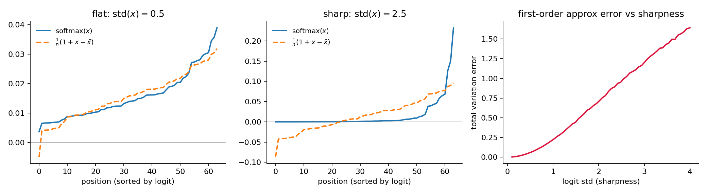

## 背景介绍

大家常用的 Softmax Attention，对第 $t$ 个 query 的输出可以写成

$$
\boldsymbol{o}_t=\sum_{i} a_{t,i}\,\boldsymbol{v}_i,\qquad
a_{t,i}=\frac{\exp(\boldsymbol{q}_t\cdot\boldsymbol{k}_i)}{\sum_{j}\exp(\boldsymbol{q}_t\cdot\boldsymbol{k}_j)}
$$

其中 $\boldsymbol{q}_t,\boldsymbol{k}_i,\boldsymbol{v}_i\in\mathbb{R}^d$，为书写简洁我们把缩放因子 $1/\sqrt{d}$ 吸收进 $\boldsymbol{q}$ 里。每个 query 都要和全部 $L$ 个 key 做内积再归一化，所以整体是 $\mathcal{O}(L^2)$ 的二次复杂度。这在 LLM 的长上下文场景已经非常昂贵，而对于视频生成或高分辨率图像生成，就更是雪上加霜。举个例子：我们要生成一段 720×1280、24 fps、一分钟的视频，假设 VAE 的压缩率是 $(4,16,16)$（时间×高×宽），那么 latent 序列就有

$$
\frac{24\times 60}{4}\times\frac{720}{16}\times\frac{1280}{16}=360\times 45\times 80\approx 1.3\ \text{million}
$$

大约 130 万个 token。在这个长度下，二次复杂度的 attention 基本就是不可接受的了。

为了后文推导方便，这里统一一下全文的记号：序列长度记为 $L$，head 维度为 $d$；向量默认是列向量，$\boldsymbol{q}\cdot\boldsymbol{k}$ 表示内积，$\boldsymbol{v}\boldsymbol{k}^{\top}$ 表示外积（$d\times d$ 矩阵）；把 token 按顺序切成大小为 $B$ 的块（block），第 $j$ 块记为 $\mathcal{B}_j$，块内 key 的均值（质心）记为 $\bar{\boldsymbol{k}}_j=\frac{1}{B}\sum_{i\in\mathcal{B}_j}\boldsymbol{k}_i$；对 query $\boldsymbol{q}_t$，被选中的 top-K 块集合记为 $\mathcal{S}_t$，未被选中的记为 $\mathcal{U}_t$。

## 稀疏注意力

近年来，稀疏注意力的工作非常多。比较标志性的有 Kimi 的 [MoBA](https://arxiv.org/abs/2502.13189) 和 DeepSeek-V3.2 的 [DSA](https://arxiv.org/abs/2512.02556)。无独有偶，在视频生成领域也有不少类似的工作，比如 [VSA](https://arxiv.org/abs/2505.13389)。

稀疏注意力的一个经验基础是：transformer 的注意力矩阵有非常明显的稀疏性，即大部分位置的 attention weight 都很低。所以稀疏注意力的核心思路就是：用便宜的成本去估算哪些位置对 attention 贡献低，把它们直接丢掉，只在估计出来贡献高的 top-K 位置上算精确 attention，从而减少计算。具体到几个代表工作：

- **DSA** 先用一个 head 数不多、可以跑 FP8 的 lightning indexer 打分：$I_{t,s}=\sum_{j=1}^{H^I} w_{t,j}\,\mathrm{ReLU}\big(\boldsymbol{q}^{I}_{t,j}\cdot\boldsymbol{k}^{I}_{s}\big)$，然后每个 query 只保留分数最高的 top-K 个 token（K 取 2048）做精确 attention。
- **MoBA** 则是把 token 分块，用块内 key 的均值当作这个块的"代表"来打分：$s_{t,j}=\boldsymbol{q}_t\cdot\bar{\boldsymbol{k}}_j$，每个 query 选 top-K 个块。
- **VSA** 把视频 token 划分成 3D block（cube），对每个 cube 做 mean pooling 得到粗粒度的 $\boldsymbol{q},\boldsymbol{k}$，先算一遍 cube 级别的粗 attention 来选 top-K 个 cube，再只在选中的 cube 内做细粒度 attention。

可以看到，稀疏注意力的核心就是**低成本估算 top-K，然后只在 top-K 位置算精确的 softmax attention，其余位置全部丢弃**。这样计算复杂度固然降下来了（LLM 里 top-K 一般选 2048 这个量级，视频生成里一般能做到 5% 或 10% 左右的稀疏度）。然而，绝大部分位置的信息被直接丢弃，在笔者看来未免有些浪费，也不够精确：那些权重不高但数量庞大的"长尾"位置，加起来的贡献其实并不可忽略。

## 线性注意力

线性注意力有很多变体和解释。在笔者的视角下，线性注意力的本质就是去**近似 softmax attention**。最经典的做法（[Katharopoulos et al., 2020](https://arxiv.org/abs/2006.16236)）是挑选一个满足 $\phi(\cdot)\ge 0$ 的特征映射，用核函数替代指数相似度：$\phi(\boldsymbol{q})\cdot\phi(\boldsymbol{k})\sim \exp(\boldsymbol{q}\cdot\boldsymbol{k})$（常用的选择如 $\phi(x)=\mathrm{elu}(x)+1$）。代回 attention 并利用乘法结合律交换求和顺序，就得到了 vanilla linear attention：

$$
\boldsymbol{o}_t=\frac{\sum_{i}\phi(\boldsymbol{q}_t)\cdot\phi(\boldsymbol{k}_i)\,\boldsymbol{v}_i}{\sum_{i}\phi(\boldsymbol{q}_t)\cdot\phi(\boldsymbol{k}_i)}
=\frac{\Big(\sum_{i}\boldsymbol{v}_i\,\phi(\boldsymbol{k}_i)^{\top}\Big)\phi(\boldsymbol{q}_t)}{\Big(\sum_{i}\phi(\boldsymbol{k}_i)\Big)\cdot\phi(\boldsymbol{q}_t)}
$$

括号里的 $\sum_i \boldsymbol{v}_i\phi(\boldsymbol{k}_i)^{\top}\in\mathbb{R}^{d\times d}$ 和 $\sum_i\phi(\boldsymbol{k}_i)\in\mathbb{R}^{d}$ 都与 query 无关，可以一次算好（因果场景下则是一个 RNN 状态递推），于是复杂度从 $\mathcal{O}(L^2)$ 降到 $\mathcal{O}(L)$。

事实上，[苏剑林的博客](https://kexue.fm/archives/11814)里也介绍过，直接对 softmax attention 做泰勒展开同样可以得到线性注意力，而且比"先近似 $\exp(\boldsymbol{q}\cdot\boldsymbol{k})$ 再归一化"更直接。具体来说，记 logits 向量 $\boldsymbol{x}=(\boldsymbol{q}\cdot\boldsymbol{k}_1,\cdots,\boldsymbol{q}\cdot\boldsymbol{k}_L)$，围绕它的均值 $\bar{\boldsymbol{x}}$ 做泰勒展开，一阶截断的结果是

$$
\mathrm{softmax}(\boldsymbol{x})_i\approx\frac{1}{L}\Big(1+\boldsymbol{q}\cdot(\boldsymbol{k}_i-\bar{\boldsymbol{k}})\Big),\qquad
\bar{\boldsymbol{k}}=\frac{1}{L}\sum_{i}\boldsymbol{k}_i
$$

这个式子的直观含义很漂亮：均值 $\bar{\boldsymbol{k}}$ 充当了注意力的"基准"，和 query 相似度高于均值的 token 就加大权重，低于均值的就减小权重。把它代回 $\boldsymbol{o}=\sum_i a_i\boldsymbol{v}_i$，整理后得到

$$
\boldsymbol{o}\approx\bar{\boldsymbol{v}}+\Big(\frac{1}{L}\sum_{i}\boldsymbol{v}_i\boldsymbol{k}_i^{\top}-\bar{\boldsymbol{v}}\bar{\boldsymbol{k}}^{\top}\Big)\boldsymbol{q}
$$

正是一个（去中心化版本的）vanilla linear attention。

甚至，在[后续这篇博客](https://kexue.fm/archives/11823)里，著名的 [Gated DeltaNet](https://arxiv.org/abs/2412.06464)（最近 [Kimi K3](https://www.kimi.com/blog/kimi-k3) 用的 KDA，就是首发于 [Kimi Linear](https://arxiv.org/abs/2510.26692) 的 GDN 变体）也可以用同样的线性化近似得到。这里简单转述一下思路。固定 query $\boldsymbol{q}$，因果 attention 的输出其实满足一个**精确**的递归式：

$$
\boldsymbol{o}_t=\boldsymbol{o}_{t-1}+a_{t,t}\,(\boldsymbol{v}_t-\boldsymbol{o}_{t-1})
$$

增量 $\boldsymbol{v}_t-\boldsymbol{o}_{t-1}$ 是"新观测减旧预测"，已经隐隐有 delta rule 的样子了。接下来只需对**对角元** $a_{t,t}$ 做上面的一阶泰勒展开 $a_{t,t}\approx\frac{1}{t}\big(1+\boldsymbol{q}\cdot(\boldsymbol{k}_t-\bar{\boldsymbol{k}}_t)\big)$（只近似对角线而非全体 $a_{t,i}$，近似负担小得多），再假设解的形式为 $\boldsymbol{o}_t\approx\boldsymbol{A}_t\boldsymbol{q}+\bar{\boldsymbol{v}}_t$，并按"最小误差原则"把递归中残留的 $\boldsymbol{q}$ 替换为 $\boldsymbol{k}_t-\bar{\boldsymbol{k}}_t$，就得到

$$
\boldsymbol{A}_t=\boldsymbol{A}_{t-1}\Big(\big(1-\tfrac{1}{t}\big)\boldsymbol{I}-\tfrac{1}{t}(\boldsymbol{k}_t-\bar{\boldsymbol{k}}_t)(\boldsymbol{k}_t-\bar{\boldsymbol{k}}_t)^{\top}\Big)+\tfrac{1}{t}(\boldsymbol{v}_t-\bar{\boldsymbol{v}}_{t-1})(\boldsymbol{k}_t-\bar{\boldsymbol{k}}_t)^{\top}
$$

对照 GDN 的标准形式 $\boldsymbol{S}_t=\boldsymbol{S}_{t-1}\,\alpha_t(\boldsymbol{I}-\beta_t\boldsymbol{k}_t\boldsymbol{k}_t^{\top})+\beta_t\boldsymbol{v}_t\boldsymbol{k}_t^{\top}$，gating 项 $\alpha_t$ 和 delta rule 项都自然地出现了。也就是说，从 vanilla linear attention 到 GDN，都可以统一在"softmax attention 的线性化近似"这一个视角下。

线性注意力的复杂度当然是 $\mathcal{O}(L)$，非常便宜。但正因为它的本质是对 softmax attention 的**近似**，它一定有损失。而且从泰勒展开的角度看，这个损失的来源非常清楚：一阶截断丢掉的是 $\boldsymbol{y}=\boldsymbol{x}-\bar{\boldsymbol{x}}$ 的二阶及以上的项，其大小由 logits 偏离均值的程度（$\overline{\boldsymbol{y}^2}$ 等高阶矩）控制。换句话说，**原始 softmax attention 的分布越 sharp（logits 方差越大），线性近似的误差就越大**；而在分布平坦的区域，线性近似相当精确。下图是一个 toy example：logits 平坦时一阶近似几乎贴着真实的 softmax 分布走，一旦分布变 sharp，尖峰处近似严重偏低、甚至在尾部出现负值，总误差随 logits 的标准差迅速增长。

## 稀疏线性注意力

现在把两边放在一起看，会发现它们正好互补：

- 线性注意力可以近似整个 attention，但在分布 **sharp 的地方（也就是 top-K 所在的地方）误差大**；
- 稀疏注意力在 top-K 位置是**精确**的 softmax attention，但把占绝大多数的**平坦区域整个丢掉了**，而平坦区域恰恰是线性近似最擅长的。

一个自然的想法就是把它们结合起来：在 top-K 区域做 sparse softmax attention，剩下的地方用线性注意力近似。[SLA](https://arxiv.org/abs/2509.24006)（Sparse–Linear Attention）就是这么做的。具体来说，它也是先用分块取平均的方式估计块级注意力权重 $P_c=\mathrm{Softmax}\big(\mathrm{pool}(\boldsymbol{Q})\,\mathrm{pool}(\boldsymbol{K})^{\top}\big)$，据此把块分成三类：top 5% 的关键块走精确的 block-sparse softmax attention，bottom 10% 直接跳过，中间约 85% 的"边缘块"走线性注意力，最后把两部分结果加起来。不过，两部分是分开算的，或者说各自有独立的 softmax 归一化分母：

$$
\boldsymbol{o}^{\mathrm{sparse}}_t=\frac{\sum_{i\in\mathcal{S}_t} e^{\boldsymbol{q}_t\cdot\boldsymbol{k}_i}\,\boldsymbol{v}_i}{\sum_{i\in\mathcal{S}_t} e^{\boldsymbol{q}_t\cdot\boldsymbol{k}_i}},\qquad
\boldsymbol{o}^{\mathrm{linear}}_t=\frac{\Big(\sum_{i\in\mathcal{U}_t}\boldsymbol{v}_i\,\phi(\boldsymbol{k}_i)^{\top}\Big)\phi(\boldsymbol{q}_t)}{\Big(\sum_{i\in\mathcal{U}_t}\phi(\boldsymbol{k}_i)\Big)\cdot\phi(\boldsymbol{q}_t)}
$$

两个分支各自归一化到权重和为 1，直接相加的话分布会有偏差，于是 SLA 需要引入一个额外的可学习投影来弥补：

$$
\boldsymbol{o}_t=\boldsymbol{o}^{\mathrm{sparse}}_t+\mathrm{Proj}\big(\boldsymbol{o}^{\mathrm{linear}}_t\big)
$$

显然，这样的组合对完整 softmax attention 的近似是有 gap 的，不能 training-free：SLA 必须对模型做微调（好在成本不高，论文里在 Wan2.1-1.3B 上只需 2000 步微调，就能在 95% 稀疏度下追平 full attention 的生成质量，端到端加速约 2.2 倍）。

于是 [PISA](https://arxiv.org/abs/2602.01077)（Piecewise Sparse Attention）提出了一个自然的改进：与其分开算两个 attention 再学一个投影去缝合，不如**直接把同一个 softmax attention 拆成两部分，然后对非 top-K 区域做泰勒展开来线性化**。把输出写成分子分母的形式 $\boldsymbol{o}_t=\mathcal{N}_t/\mathcal{D}_t$，按选中/未选中把两者都拆开，对每个未选中的块 $j\in\mathcal{U}_t$，把指数在块质心 $\bar{\boldsymbol{k}}_j$ 处展开：

$$
\exp(\boldsymbol{q}_t\cdot\boldsymbol{k}_i)
=\underbrace{\exp(\boldsymbol{q}_t\cdot\bar{\boldsymbol{k}}_j)}_{=:\ \alpha_{t,j}}\cdot\exp\big(\boldsymbol{q}_t\cdot(\boldsymbol{k}_i-\bar{\boldsymbol{k}}_j)\big)
\approx \alpha_{t,j}\Big(1+\boldsymbol{q}_t\cdot(\boldsymbol{k}_i-\bar{\boldsymbol{k}}_j)\Big)
$$

即零阶加一阶的泰勒展开。先看分母：由于块内偏差和恒为零（$\sum_{i\in\mathcal{B}_j}(\boldsymbol{k}_i-\bar{\boldsymbol{k}}_j)=\boldsymbol{0}$），一阶项在分母中**严格消掉**，只剩

$$
\mathcal{D}_t=\underbrace{\sum_{j\in\mathcal{S}_t}\sum_{i\in\mathcal{B}_j} e^{\boldsymbol{q}_t\cdot\boldsymbol{k}_i}}_{\text{精确分支}}+\underbrace{B\sum_{j\in\mathcal{U}_t}\alpha_{t,j}}_{\text{零阶近似}}
$$

也就是说，每个未选中的块被压缩成了一个权重为 $B\cdot\alpha_{t,j}$ 的"虚拟 token"。分子则是精确项、零阶项、一阶修正项三部分：

$$
\mathcal{N}_t=\sum_{j\in\mathcal{S}_t}\sum_{i\in\mathcal{B}_j} e^{\boldsymbol{q}_t\cdot\boldsymbol{k}_i}\,\boldsymbol{v}_i
+\sum_{j\in\mathcal{U}_t}\alpha_{t,j}\Big(\sum_{i\in\mathcal{B}_j}\boldsymbol{v}_i\Big)
+\sum_{j\in\mathcal{U}_t}\alpha_{t,j}\,\boldsymbol{H}_j\,\boldsymbol{q}_t
$$

其中 $\boldsymbol{H}_j=\sum_{i\in\mathcal{B}_j}\boldsymbol{v}_i(\boldsymbol{k}_i-\bar{\boldsymbol{k}}_j)^{\top}$ 是块内 key–value 的一阶交叉统计量。为了让一阶项也是严格线性复杂度，PISA 进一步用所有块的平均 $\bar{\boldsymbol{H}}=\frac{B}{L}\sum_j\boldsymbol{H}_j$ 替换逐块的 $\boldsymbol{H}_j$，于是一阶修正简化为 $\big(\sum_{j\in\mathcal{U}_t}\alpha_{t,j}\big)\bar{\boldsymbol{H}}\,\boldsymbol{q}_t$，与 query 无关的统计量都可以预先算好。

和 SLA 对比，关键区别一目了然：PISA 的精确分支和近似分支**共享同一个 softmax 分母** $\mathcal{D}_t$，两部分天然处在同一个归一化体系里，不存在分布失配，自然也不需要额外的投影层去缝合。注意，PISA 的方法本身并不局限于 training-free——原文只做了 training-free 的实验（在 Wan2.1、HunyuanVideo 等模型上，87.5% 稀疏度下 VBench 基本无损，加速约 2 倍），这在笔者看来恰恰说明了它对 softmax attention 的近似是很精确的：不用动模型一根手指头，就能直接替换掉 full attention。

回过头看，这条线索其实非常连贯：稀疏注意力说"权重小的位置不重要，丢掉"，线性注意力说"整个 attention 都可以线性近似"，而稀疏线性注意力说的是：**在分布 sharp 的地方保留精确计算，在分布平坦的地方用泰勒展开近似**，把"丢弃"升级为"近似"，正好让两种方法各自补上了对方的短板。

## 更进一步：补上二阶项（PWT）

仔细端详一下 PISA 的展开，会发现一处"不对称"：分子取到了一阶，而分母只有零阶——当然这不是漏算，上面推导过，一阶项在分母里因为 $\sum_{i\in\mathcal{B}_j}(\boldsymbol{k}_i-\bar{\boldsymbol{k}}_j)=\boldsymbol{0}$ 严格消掉了。但这恰恰说明：**分母的下一个非零修正在二阶**。而按照[苏剑林那篇博客](https://kexue.fm/archives/11814)对 LogSumExp 的展开，这个二阶项有非常干净的闭式。于是笔者做了一个自然的拓展：把 PISA 的块质量估计补到二阶，下文称为 PWT（Piecewise-Taylor）。

推导只需两行。把未选中块 $j\in\mathcal{U}_t$ 的真实质量写成零阶乘以一个平均因子，记 $y_{t,i}=\boldsymbol{q}_t\cdot(\boldsymbol{k}_i-\bar{\boldsymbol{k}}_j)$（块内均值为零），泰勒展开到二阶：

$$
\sum_{i\in\mathcal{B}_j} e^{\boldsymbol{q}_t\cdot\boldsymbol{k}_i}
=B\,\alpha_{t,j}\cdot\frac{1}{B}\sum_{i\in\mathcal{B}_j} e^{y_{t,i}}
\approx B\,\alpha_{t,j}\Big(1+\underbrace{\frac{1}{B}\sum_{i\in\mathcal{B}_j} y_{t,i}}_{=\,0}+\frac{1}{2B}\sum_{i\in\mathcal{B}_j} y_{t,i}^2\Big)
=B\,\alpha_{t,j}\big(1+w_{t,j}\big)
$$

其中

$$
w_{t,j}=\frac{1}{2}\,\boldsymbol{q}_t^{\top}\boldsymbol{C}_j\,\boldsymbol{q}_t,\qquad
\boldsymbol{C}_j=\frac{1}{B}\sum_{i\in\mathcal{B}_j}(\boldsymbol{k}_i-\bar{\boldsymbol{k}}_j)(\boldsymbol{k}_i-\bar{\boldsymbol{k}}_j)^{\top}
$$

正是块内 key 的协方差矩阵——苏文中 $\mathrm{logsumexp}$ 展开的二阶项 $\overline{\boldsymbol{y}^2}/2$ 在分块场景下的具体形态。注意 $w_{t,j}\ge 0$：由 Jensen 不等式，$\frac{1}{B}\sum_i e^{y_i}\ge e^{\bar{y}}=1$，也就是说**零阶近似必然系统性低估块质量，块内方差越大低估越狠**，而二阶项恰好朝正确的方向修回来。实现上我们把 $1+w$ 写成 $e^{w}$（$w$ 小时等价），这样它直接加在虚拟 token 的 logit 上——虚拟 token 权重从 $B\,e^{\boldsymbol{q}_t\cdot\bar{\boldsymbol{k}}_j}$ 变成 $B\,e^{\boldsymbol{q}_t\cdot\bar{\boldsymbol{k}}_j+w_{t,j}}$——分子零阶项、一阶修正的权重和分母共用同一个修正后的 logit，归一化自动保持一致，online softmax 的流程一行都不用改。

剩下的问题是 $w_{t,j}$ 的成本：逐 query 逐块算 $\boldsymbol{q}^{\top}\boldsymbol{C}_j\boldsymbol{q}$ 是笔 $\mathcal{O}(d^2)$ 的开销。这里做两步廉价化：先取对角近似 $\boldsymbol{q}^{\top}\boldsymbol{C}_j\boldsymbol{q}\approx\sum_{c} q_c^2\,\sigma_{j,c}^2$（$\sigma_{j,c}^2$ 为块内第 $c$ 维方差），再把 $q^2$ 沿 query 块池化。这里有个容易踩的坑：池化必须用 $\overline{\boldsymbol{q}^2}$（先平方再平均）而不是 $\bar{\boldsymbol{q}}^2$（先平均再平方）——后者把 query 块内的方差全部抹掉，精度会明显回退。这样 $w$ 就退化成一个 [query 块 × key 块] 的小矩阵，和 $\bar{\boldsymbol{k}}_j,\boldsymbol{H}_j$ 一样可以在进 kernel 之前一次算好，kernel 里只是一次广播加法，**相比 PISA 几乎零额外开销**。我们实测这个"对角 + 池化"版本与逐行精确计算 $w$ 的近似误差几乎一致，但后者会让 kernel 慢近一倍——泰勒展开的收益全在这个二阶统计量本身，精细到逐行反而不值。

顺带地，二阶项还让 top-K 路由有了更有原则的解释：块的截断误差大致正比于"质量 × 块内异质性"，于是打分可以直接用 $\log\big(B\,e^{\boldsymbol{q}\cdot\bar{\boldsymbol{k}}_j+w_j}\big)+\log\lVert\boldsymbol{H}_j\rVert$——质量大**或**泰勒展开失效（方差大）的块进精确分支。PISA 原文中 covariance-aware 的选块启发式，在展开的视角下就是"按预测截断误差路由"。

最后分享一个笔者在视频生成模型上实际使用 PWT 的教训。在随机高斯输入的 unit test 上，PWT 一切美好（近似误差相对 PISA 降低约 13%，速度持平）；可一接上真实 DiT 的激活，生成的视频反而崩了。定位下来：真实激活的 q/k 里有少量 outlier 维度（幅值可以到 $10^3$ 量级），而 $w\propto q^2\sigma^2$ 是二次项，会被放大到 $10^8$ nats 的量级，虚拟 token 的 logit 直接爆表。修复也很简单：给 $w$ 加一个上界 $\ln B$——直觉上，$\ln B$ 是"块内质量全部集中在单个 token"相对"均匀分布"的质量比的对数，二阶修正若声称超过这个幅度，说明块内分布已经尖锐到泰勒展开根本不适用，此时让它退回 PISA 的保守零阶行为反而是对的。加上这个 cap 之后，PWT 在真实激活上的单步近似精度反超 PISA，生成质量也恢复正常。这也是笔者想强调的一点：**近似方法的失效模式往往藏在真实数据的分布尾部**。

和 PISA 一样，PWT 的两个分支共享同一个分母，天然 training-free；我们也同步实现了完整的 backward（梯度流经全部块统计量 $\bar{\boldsymbol{k}}_j,\boldsymbol{H}_j,\sigma_j^2$，top-K 路由按惯例 detach），所以它同样可以直接拿去做稀疏微调——在 85% 稀疏度下，训练端到端（前向 + 反向）相对 full attention 约有 2.5 倍加速。

PWT 的代码（forward/backward kernel 和参考实现）已经整理开源在 [HaoyiZhu/Piecewise-Taylor-Attention](https://github.com/HaoyiZhu/Piecewise-Taylor-Attention)，感兴趣的读者可以关注。

## 参考链接

- [MoBA: Mixture of Block Attention for Long-Context LLMs](https://arxiv.org/abs/2502.13189)
- [DeepSeek-V3.2 (DSA)](https://arxiv.org/abs/2512.02556)
- [VSA: Faster Video Diffusion with Trainable Sparse Attention](https://arxiv.org/abs/2505.13389)
- [Transformers are RNNs: Fast Autoregressive Transformers with Linear Attention](https://arxiv.org/abs/2006.16236)
- [苏剑林：LogSumExp 和 Softmax 的泰勒展开](https://kexue.fm/archives/11814)
- [苏剑林：将 Softmax Attention 线性化为 Gated DeltaNet](https://kexue.fm/archives/11823)
- [Gated Delta Networks: Improving Mamba2 with Delta Rule](https://arxiv.org/abs/2412.06464)
- [Kimi Linear: An Expressive, Efficient Attention Architecture (KDA)](https://arxiv.org/abs/2510.26692)
- [SLA: Beyond Sparsity in Diffusion Transformers via Fine-Tunable Sparse–Linear Attention](https://arxiv.org/abs/2509.24006)
- [PISA: Piecewise Sparse Attention Is Wiser for Efficient Diffusion Transformers](https://arxiv.org/abs/2602.01077)
- [PWT 代码：HaoyiZhu/Piecewise-Taylor-Attention](https://github.com/HaoyiZhu/Piecewise-Taylor-Attention)
